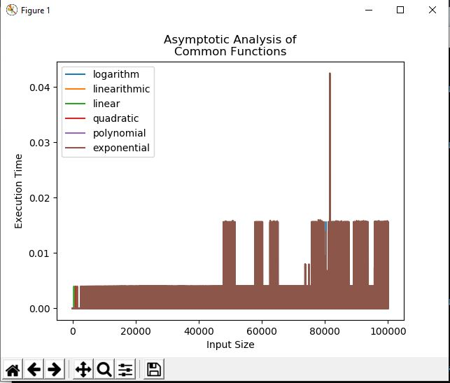

# Asymptotic-Analysis

Python Program for Asymptotic Analysis on some common functions:
1. Logarithmic O(log(n))
2. Linearithmic O(n log n)
3. Linear O(n)
4. Quadratic O(n**2)
5. Polynomial O(n**C)
6. Exponential O(2**n)

The output of the program is being shown in a graph:

